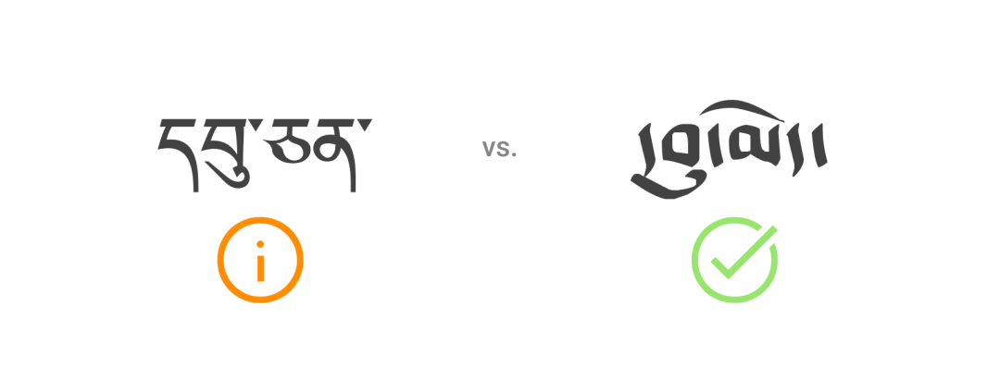
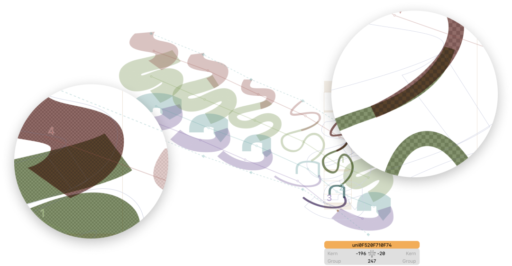

# UmeSansBeta fonts documentation

This repository contains documentation about the UmeSansBeta fonts project. It also serves as a site for documenting the exploration of translating concepts and terms from Western typeface and graphic design into the Tibetan language.

"UmeSansBeta" is a temporary name for an open-source project that explores sans-serif Tibetan font design based on Ume scripts. The major goal of the project is to investigate the technical, aesthetic, and usability aspects of applying the concept of sans-serif typography to Tibetan scripts, creating a neutral, modern, and legible font family.

We look forward to welcoming more contributors to join our journey of advocating for the digital presence of the Tibetan language and invigorating the artistic creativity of the community in our time.

You can download the latest version here on GitHub. A more stable version is available on [Baidupan (百度云盘)]( https://pan.baidu.com/s/1vdxChrwu2VaudwscPnyIaw?pwd=1111) for users from mainland China.

## Design Rationale & Goals 

This section explains the rationale, goals, and current challenges of this project.

### ཇུས་འགོད་ཀྱི་ཀུན་སློང་། Design Discussion

རང་རེའི་ཡིག་གཟུགས་འབྲི་སྟངས་དབུ་ཅན་དང་དབུ་མེད་ཁྲོད་ནས་ང་ཚོས་ཕྱི་མ་དེ་ཟོར་ཡང་བའི་སྤྲོས་མེད་ཡིག་གཟུགས་ཀྱི་རྣམ་པ་ཇུས་འགོད་བྱེད་པར་འཚམ་པས་དེ་རྨང་གཞིར་བཟུང་བ་ཡིན།

1. ཐོག་མར་ཡིག་གཟུགས་གསར་པ་འདི་སྤྱི་ཚོགས་འཚོ་བའི་ཕྱོགས་སོ་སོར་སྤྱོད་བདེ་བའི་ཆེད་དུ་ཇུས་འགོད་བྱས་པ་ཡིན་པས། གོ་ཆོད་པ་དང་ལས་ཆོད་ཆེ་བ་ནི་ང་ཚོའི་རེ་བ་་ཡིན། དབུ་མེད་ནི་བྲིས་མགྱོགས་པའི་ཡི་གེ་འབྲི་སྟངས་ཞིག་ཡིན་པའི་ཆ་ནས་བོད་ཡིག་སྟབས་ཇེ་བདེ་དང་གོ་ཇེ་ཆོད་འགྲོ་བའི་འཕེལ་རྒྱས་ཁ་ཕྱོགས་དང་མཐུན་པ་མ་ཟད་ང་ཚོས་ཡིག་གཟུགས་གསར་པ་འདི་བཟོ་བའི་ཀུན་སློང་དང་ཡང་མ་གྲོས་རང་མཐུན་རེད།

2. དེར་ཐད་དབུ་མེད་ལ་རང་སྟེང་ནས་སྐོང་ཡིག་སོགས་ལྟོས་བཅོས་བྲི་བདེ་བའི་རང་བཞིན་ལྡན་པ་དང་ཕྱི་རྣམ་པའི་ཆ་ནས་ལ་ཏིང་（Latin）ཡིག་གཟུགས་དང་ཡང་ཅུང་འདྲ་ཆགས་པོ་ཡོད་པ་དང་ང་ཚོས་ནུབ་གླིིང་གི་ཡིག་གཟུགས་ཇུས་འགོད་ཐད་ཀྱི་ཉམས་མྱོང་རྣམས་ཡིག་གསར་འདིའི་ཇུས་འགོད་ཐད་ལའང་གོ་ཆོད་སོང་ལ། ད་དུང་བྱ་རིམ་སྒྲིག་བཀོད་ཐད་ནས་ཡང་ལས་ཚགས་མང་པོ་ཞིག་ལ་གཡོལ་ཐུབ་པ་བྱུང་།

3. མཐར་རང་རེའི་སྲོད་རྒྱུན་དབུ་མེད་ཡིག་གཟུགས་ལ་གཞལ་དུ་མེད་པའི་སྒྱུ་རྩལ་ཀྱི་རིན་ཐང་དང་མགྱོགས་བྲིས་ཉེར་སྤྱོད་སོགས་ཐུན་མོང་མ་ཡིན་པའི་ཁྱད་ཆོས་ཕུན་སུམ་ཚོགས་པ་ཡོད་པ་འདིས། ང་ཚོས་མ་འོངས་པར་ཡིག་གཟུགས་སྔར་ལས་ལྷག་པ་གསར་རྩོམ་བྱེད་པར་རུམ་བྲོ་གྱ་ནོམ་པ་ཞིག་བསྩལ་ཡོད།

མདོར་ན། ང་ཚོའི་ཇུས་འགོད་ཀྱི་རིག་ལམ་འདི་དང་འདི་ལས་བྱུང་བའིི་ཡིག་གཟུགས་འདིས་བོད་ཀྱི་ཡི་གེ་སྤྱིའི་འཕེལ་འགྲོས་དང་མཐུན་པར་སྨོན།

We chose the Ume letterform instead of the Uchen letterform as the meta-form for exploring a sans-serif style in Tibetan scripts.

1. Practical Design Goals: Targeting modern secular life as the primary context for our font family suggests designing something practical. The Ume letterform, as a “cursive” style optimized for more efficient handwriting, represents a milestone in the simplification and practical evolution of Tibetan scripts. Therefore, we chose Ume since its appearance aligns well with our design goals.

2. Simpler Letterforms: The shape of Ume letters is simpler and more similar to Latin letters, allowing us to apply Latin typeface design knowledge more effectively and reduce the workload to a certain extent.

3. Calligraphic Inspiration: There are numerous calligraphic variants of Ume writing that highlight the diverse personal expressions of calligraphers. We intend to draw inspiration from these traditions when creating new typefaces or variants of this font family in the future.

Our goal is to synchronize our design with existing typographic trends.

## Design Variables 
ཡིག་གཟུགས་གསར་བ་འདིར་ནུབ་གླིང་ཡིག་གཟུགས་ཇུས་འགོད་ཀྱི་རྒྱུན་སྤྱོད་ཐ་སྙད་ལས་ཚད་གཞི་གསུམ་གདམ་ནས་ཚོད་ལྟའི་ཇུས་འགོད་བྱས་ཡོད་ལ། དེ་དག་ནི་སྣག་ཆ། ཡིག་ཞེང་། སྦོ་བཀྱགས།

In this design exploration, we introduced three variables from Latin typeface design into this font family: Weight, Width, and Descender Depth.

### སྣག་ཆ། Weight

ད་ལྟའི་ཀློག་ཀླད་དང་ཁ་པར་དུ་བཀོད་བཞིན་པའི་ཡིག་གཟུགས་མང་ཆེ་ཤས་ནི་སྲོལ་རྒྱུན་གྱི་ཡིག་གཟུགས་ཇི་བཞིན་བཀོད་པ་ལས་དེང་རབས་སྙོམས་ངོས་ཇུས་འགོད་ཀྱི་སྤྱི་དོན་ལྟར་ཇུས་འགོད་བྱས་ཡོད་པ་ཤིན་ཏུ་སྐོན། དེ་བས་ད་ཐེངས་ང་ཚོས་ཡིག་གསར་༼ཁ་བ།༽ཚོད་ལྟའི་པར་གཞི་འདིའི་ནང་དུ་ཡི་གེའི་སྣག་ཆའི་ཆེ་ཆུང་ཐད་འགྱུར་བ་ཤུགས་ཆེར་བཏང་ཡོད། དེ་ནི་ཇུས་འགོད་དང་བྱ་རིམ་སྒྲིག་བཀོད་ཕྱོགས་ནས་ཚོད་བགམ་དང་གནད་དོན་འཚོལ་རྟོགས་བྱེད་པའི་ཆེད་དུ་ཡིན། 
གཤམ་གྱི་རི་མོ་ལས་ང་ཚོས་ཆེས་ཕྲ་བ་དང་ཆེས་སྦོམ་པའི་ཡི་གེའི་གཟུགས་རིས་ཇུས་འགོད་བྱེད་སྐབས་ཡག་པོ་མ་འཁྱོངས་བའི་དཔེ་གཞི་ཞིག་རེད།ཐོག་མའི་ཚོད་ལྟའི་པར་གཞིའི་ནང་དུ་འདི་འདྲའི་ཞན་ཆ་དང་གནད་དོན་ད་དུང་མང་པོ་ཡོད།དེར་བརྟེན།ང་ཚོས་ལྷན་རྒྱས་དང་མཉམ་དུ་ང་ཚོའི་གསར་སྤེལ་བརྒྱུད་རིམ་ཁྲོད་ཀྱི་ཉམས་མྱོང་དང་བསླབ་བྱ་མཉམ་སྤྱོད་བྱ་རྒྱུ་མ་ཟད།ལྷན་དུ་གནད་དོན་དེ་དག་ཐག་གཅོད་དང་ཇུས་གཞིར་དཔྱད་བསྡུར་བྱ་རྒྱུའི་རེ་བ་ཡོད༷།

Most digital Tibetan typefaces available today aim to represent traditional calligraphic styles. Only a few font families genuinely incorporate modern concepts of font weight into their designs.

Thus, we exaggeratedly experimented with weight variants in UmeSansBeta, hoping to uncover and address as many design and development challenges as possible.

The figure below illustrates an example of imperfect design during the development of extremely thin and thick glyphs. There are several other cases of imperfection in this beta version. We’re more than happy to share our learning experiences and look forward to finding solutions together.

### ཡིག་ཞེང་། Width

དབུ་མེད་སུག་རིང་ལ་དཔེ་བལྟས་ནས་ཡི་གེའི་ཞེང་ཁོལ་རྣམ་པ་གཏན་འཁེལ་བྱས་པ་ཡིན།

我们参考了簇仁体中对于水平压缩藏文字母处理方式。

### སྦོ་བཀྱགས། Descender Depth

དབུ་མེད་ཡིག་གཟུགས་ལ་ཅུང་འཁྱུག་པའི་རང་བཞིན་ལྡན་ལ། དབྱངས་དང་གསལ་བྱེད་ཀྱི་ཆ་ཚད་ལྟོས་བཅས་ཀྱིས་དོ་མཉམ་པོ་ཞིག་མེད། ཡིག་གཟུགས་གསར་བ་འདི་ཇུས་འགོད་བྱེད་སྐབས་ཞི་འཇགས། བར་གནས། གྲལ་དག སྤྱོད་སྒོ་ཅན་གྱི་མཛེས་པ་ཐོན་ཐུབ་ན་བསམ་ཡོད། དེ་བས་ཡི་གེའི་རྐང་པ་ཐུང་ངུ་ཅན་དཔེ་གཟུགས་ཀྱི་ཡིག་ཚུགས་དཔེ་གཞིར་བཟུང་ནས་བཟོས་པ་ཡིན།

The vowel marks and descenders of consonant letters in many Ume calligraphic styles are often very large, producing a rich and vibrant visual effect. However, since we aim for a calm, neutral, simple, and efficient design, we chose the Betsug style as our primary calligraphic reference, as it features the shortest descenders among Ume calligraphy styles.

ཡང་ཚད་ངེས་ཅན་ཞིག་གི་ཐོག་ཡི་གེའི་རྐང་བ་ཅུང་རིང་པོར་བཞག་ན་གསལ་བྱེད་སོ་སོ་ཁྱད་ཆོས་འབུར་དུ་ཐོན་པ་མ་ཟད་སྤྱིའི་ཆ་ནས་དོ་མཉམ་ལ་ཀློག་བདེ། དེ་བས་དཀྱིས་ཡིག་གི་ནང་ཡི་གེའི་རྐང་བ་རིང་པོ་སོར་བཞག་བྱས་ཡོད།

At the same time, we recognize that a proper descender depth improves legibility, so we have given deeper descenders to our text fonts compared to display fonts.

ཡིག་གཟུགས་འདི་གསར་བཟོ་མཁན་ང་ཚོ་ཆུ་ཚད་དམའ་བ་དང་སྤྲོས་མེད་ཡིག་གཟུགས་ཇུས་འགོད་ཀྱི་རྣམ་པ་གསར་བ་འདི་བོད་ཡིག་ཁྲོད་སྤྱོད་པ་ད་དུང་ཚོད་ལྟའི་ཚད་རིམ་དུ་གནས་ཡོད་པས། ད་ཐེངས་གི་ཚོད་ལྟའི་པར་གཞི་འདིར་མི་འདང་ས་གང་མང་ཞིག་ཡོད་ངེས། ཚང་མས་བསམ་འཆར་གང་མང་འདོན་རྒྱུ་ཐུགས་རྗེ་ཆེ། ཐད་ཀར་ཞབས་འཆན་འབྲི་བ་འམ་ང་ཚོར་འབྲེལ་གཏུག་བྱེད་ཆོག ང་ཚོས་ཁྱེད་དང་གླེང་མོལ་བྱེད་པར་རེ་སྒུག་བྱས་ཡོད།

Given the limited precedent for applying a sans-serif style in Tibetan scripts, this beta version is experimental and far from perfect. Please share your feedback to help us improve the design and development quality. Leave a comment, reply, or email us.

## About us & Contributing

UmeSansBeta is inspired by various attempts of trying sans serif style in font design among the younger generation of native Tibetan language users, graphic designers, and developers in early 2021. After Kedi Zhang finished up the preliminary working prototype in mid 2022, Pentsok Whenggyel Rtsang and Dondrup Dorje started contributing to the project in various perspectives like design concept investigation and jargon translation, design feedback and iteration, as well as external communication work.

UmeSansBeta is inspired by various attempts at sans-serif font design by younger native Tibetan language users, graphic designers, and developers since early 2021. After Kedi Zhang completed a preliminary working prototype in mid-2022, Pentsok Whenggyel Rtsang and Dondrup Dorje started contributing to the project in various ways, including jargon translation, collecting design feedback, and external communication.

You can help with UmeSansBeta development in several ways:

- Test the fonts in various documents.
- Report problems you encounter.
- Provide design critiques.
- Suggest better translations.
- Submit changes to the fonts.

- [Weibo](https://weibo.com/n/KhaWaType)
- [Twitter](https://twitter.com/KhaWaType)
- [Download (百度云盘 in Chinese)](https://pan.baidu.com/s/1vdxChrwu2VaudwscPnyIaw?pwd=1111)
- Kedi [Weibo](https://weibo.com/u/6240241937)
- Dorje [Weibo](https://weibo.com/u/5455099517) [Twitter](https://twitter.com/DhondapD)
- Pentsok [Instagram](https://www.instagram.com/artist_puntsok/)
